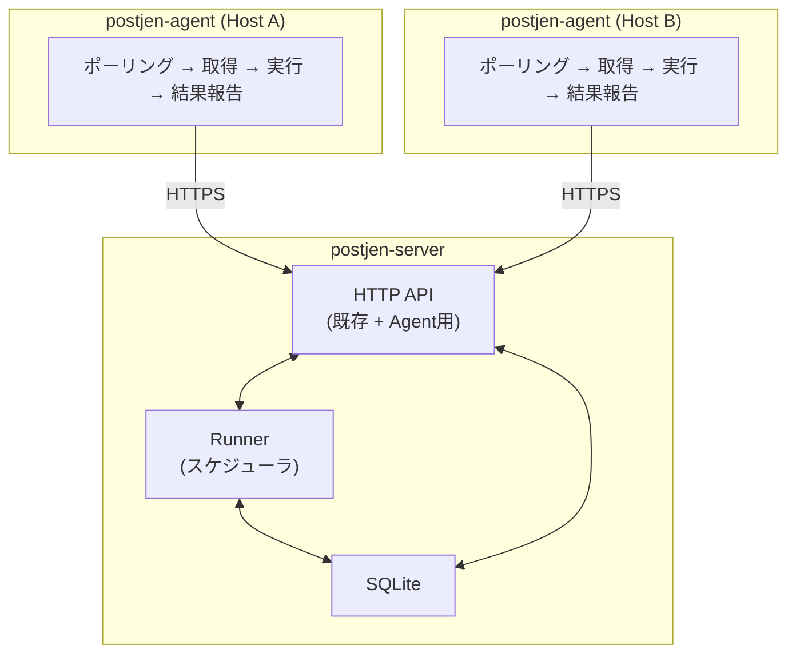
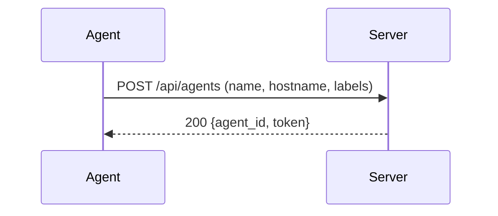
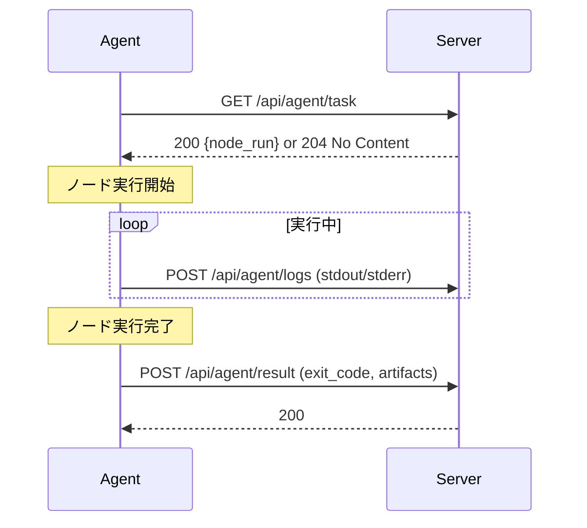
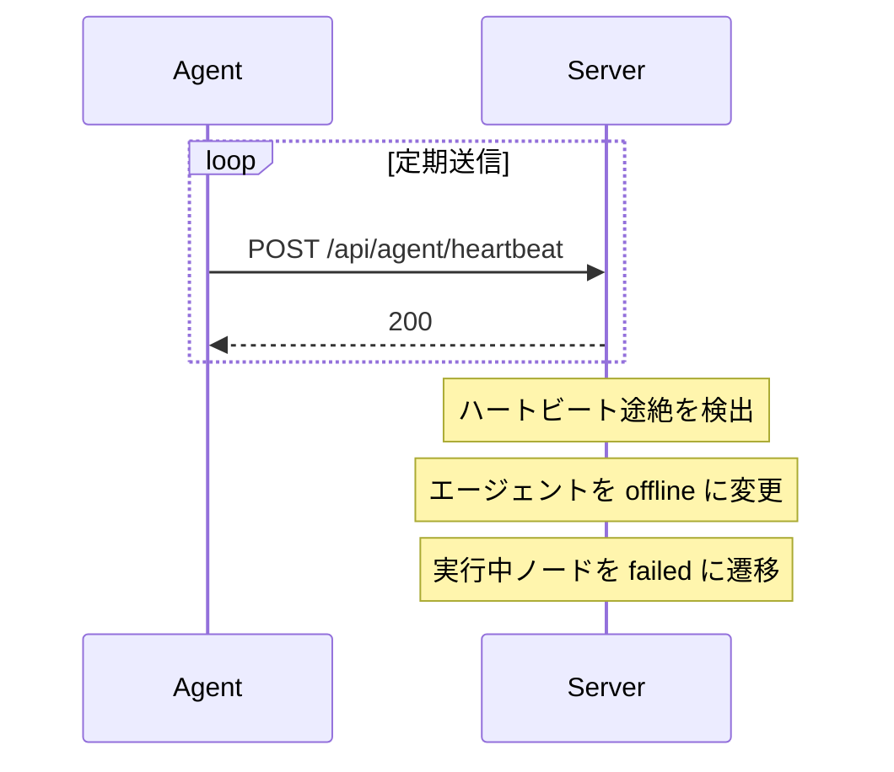

# リモートエージェント設計

## 目的

postjen を複数マシンで連携させ、ジョブのノードを他 PC 上で実行できるようにする。

現在の postjen は単一ホスト上でのみジョブを実行する。本設計により、ネットワーク上の別マシンに配置したエージェントにノード実行を委譲できるようにする。

## 基本方針

- Agent Pull 型を採用する
- エージェントがサーバに定期的にポーリングし、自分宛のタスクを取得して実行する
- サーバからエージェントへの接続は不要とする（NAT / FW 越えが容易）
- サーバは既存の postjen-server を拡張する
- エージェントは新規バイナリ `postjen-agent` として実装する

## アーキテクチャ



### サーバの役割

- ジョブ定義の管理とスケジューリング（既存）
- エージェントの登録・管理
- ノード実行の割当先決定
- エージェントからの結果・ログ受信と DB 記録
- ローカル実行の維持（エージェント未指定ノードは従来通りサーバ上で実行）

### エージェントの役割

- サーバへの登録（起動時）
- 定期ポーリングによるタスク取得
- ノードの実行（`tokio::process::Command` で既存 runner と同等の処理）
- 実行ログ・結果・成果物情報のサーバへの報告
- ハートビートの送信

## 通信フロー

### 1. エージェント登録



エージェントは起動時にサーバへ自身を登録する。サーバは一意な `agent_id` と認証トークンを発行する。

### 2. タスクポーリングと実行



### 3. ハートビート



## エージェント識別とラベル

エージェントは以下の属性を持つ。

| 属性 | 説明 |
|------|------|
| `agent_id` | サーバが発行する一意な識別子 |
| `name` | エージェントの表示名（ユーザー指定） |
| `hostname` | エージェントが動作するホスト名 |
| `labels` | タスク割当に使うラベル群（例: `["linux", "gpu", "builder"]`） |
| `status` | `online` / `offline` |
| `last_heartbeat_at` | 最終ハートビート時刻 |

## ノードのエージェント割当

ジョブ定義の `defaults` またはノード個別に `target` を指定して、実行先を制御する。

```yaml
version: 1
id: distributed-build
name: Distributed Build
defaults:
  working_dir: /opt/repos/sample
  target:
    labels: ["linux"]           # linux ラベルを持つエージェントで実行
nodes:
  - id: test
    program: cargo
    args: ["test"]

  - id: gpu-bench
    program: ./bench.sh
    target:
      labels: ["gpu"]           # ノード単位で上書き可能
    depends_on: ["test"]
```

割当ルール:

- `target` 未指定のノードはサーバがローカル実行する（既存動作と互換）
- `target.labels` が指定されたノードは、合致するラベルを持つ `online` エージェントに割り当てる
- 複数エージェントが合致する場合、サーバが負荷を考慮して選択する（初期実装ではラウンドロビン）
- 合致するエージェントがない場合、ノードは `queued` のまま待機する

## セキュリティ考慮

- エージェント ↔ サーバ間の通信は HTTPS を推奨する
- エージェント登録時にサーバが発行するトークンで認証する
- トークンは `Authorization: Bearer <token>` ヘッダで送信する
- 初期実装ではサーバ起動時に設定する共有シークレットでエージェント登録を認可する
- 本格運用では TLS クライアント証明書や外部認証基盤との連携を検討する

## DB 拡張の概要

### agents テーブル

エージェントの登録情報を管理する。

主要カラム: `id`, `agent_id`, `name`, `hostname`, `labels_json`, `status`, `token_hash`, `last_heartbeat_at`, `registered_at`

### node_runs テーブル拡張

既存の `node_runs` に以下を追加する。

- `assigned_agent_id` — 実行を担当するエージェントの ID（NULL ならローカル実行）

## API 拡張の概要

### エージェント管理 API（サーバ管理者向け）

| メソッド | パス | 説明 |
|----------|------|------|
| `GET` | `/api/agents` | エージェント一覧 |
| `POST` | `/api/agents` | エージェント登録 |
| `GET` | `/api/agents/:agent_id` | エージェント詳細 |
| `DELETE` | `/api/agents/:agent_id` | エージェント削除 |

### エージェント用 API（エージェントプロセスが使用）

| メソッド | パス | 説明 |
|----------|------|------|
| `GET` | `/api/agent/task` | 実行可能なタスクを取得 |
| `POST` | `/api/agent/result` | ノード実行結果を報告 |
| `POST` | `/api/agent/logs` | 実行ログをバッチ送信 |
| `POST` | `/api/agent/heartbeat` | ハートビート送信 |

## Runner 拡張の方針

既存の runner はサーバ上で直接 `tokio::process::Command` を実行している。リモート実行対応では以下のように拡張する。

1. runner がノードをスケジュールする際、`target` の有無を確認する
2. `target` なし → 既存のローカル実行パス（変更なし）
3. `target` あり → `node_runs.assigned_agent_id` を設定し、ノードを `queued` で待機させる
4. エージェントが `/api/agent/task` でポーリングし、自分に割り当てられたノードを取得する
5. エージェントが実行を完了したら `/api/agent/result` で結果を報告する
6. サーバ側 runner は結果を受けて後続ノードの依存判定を続行する

## postjen-agent バイナリ

Cargo ワークスペースに `crates/postjen-agent` を追加する。

主要コンポーネント:

- **設定**: サーバ URL、エージェント名、ラベル、ポーリング間隔
- **登録**: 起動時にサーバへ自身を登録
- **ポーリングループ**: 一定間隔でタスクを取得
- **実行エンジン**: 既存 runner.rs のノード実行ロジックを共有ライブラリとして切り出して利用
- **ログ送信**: 実行中のログをバッチでサーバに送信
- **ハートビート**: 別タスクで定期送信

## 段階的導入

### Phase 1: 基盤整備

- `agents` テーブル追加
- エージェント管理 API 追加
- `node_runs` に `assigned_agent_id` 追加

### Phase 2: エージェント実装

- `postjen-agent` バイナリの雛形作成
- ポーリング・実行・結果報告の基本フロー
- ノード実行ロジックの共有ライブラリ化

### Phase 3: 割当と統合

- ジョブ定義の `target` フィールド対応
- runner のスケジューリング拡張
- ハートビートとオフライン検出

### Phase 4: 運用強化

- 認証の強化
- エージェントの自動再登録
- 負荷分散の改善
- Web UI からのエージェント監視

## テスト方法

すべてのテストは同一マシン上で完結する。サーバとエージェントを localhost で起動し、リモート実行の一連のフローを検証する。

### 前提

```bash
# ターミナル 1: サーバ起動
cargo run -p postjen-server

# ターミナル 2: エージェント起動（ラベル付き）
cargo run -p postjen-agent -- \
  --server-url http://127.0.0.1:3000 \
  --name local-agent \
  --labels test,builder
```

### Phase 1 テスト: エージェント管理 API

エージェント CRUD の基本動作を curl で確認する。

```bash
# エージェント登録
curl -X POST http://127.0.0.1:3000/api/agents \
  -H "Content-Type: application/json" \
  -d '{"name":"manual-agent","hostname":"localhost","labels":["test"]}'
# → agent_id と token が返却されること

# エージェント一覧
curl http://127.0.0.1:3000/api/agents
# → 登録したエージェントが含まれること

# エージェント詳細
curl http://127.0.0.1:3000/api/agents/{agent_id}
# → name, hostname, labels, status が正しいこと

# エージェント削除
curl -X DELETE http://127.0.0.1:3000/api/agents/{agent_id}
# → 一覧から消えること
```

### Phase 2 テスト: ポーリングと実行の基本フロー

エージェントを起動せずに、curl でエージェント用 API を手動で叩いてフローを検証する。

```bash
# 1. エージェント登録してトークンを取得
TOKEN=$(curl -s -X POST http://127.0.0.1:3000/api/agents \
  -H "Content-Type: application/json" \
  -d '{"name":"test-agent","hostname":"localhost","labels":["test"]}' \
  | jq -r '.token')

# 2. タスクポーリング（まだジョブがないので 204 を期待）
curl -s -o /dev/null -w "%{http_code}" \
  -H "Authorization: Bearer $TOKEN" \
  http://127.0.0.1:3000/api/agent/task
# → 204

# 3. target 付きジョブを登録・実行
curl -X POST http://127.0.0.1:3000/api/jobs \
  -H "Content-Type: application/json" \
  -d '{"definition_path":"examples/jobs/sample-remote.yaml","enabled":true}'

curl -X POST http://127.0.0.1:3000/api/jobs/sample-remote/runs \
  -H "Content-Type: application/json" \
  -d '{"trigger_type":"manual","triggered_by":"tester"}'

# 4. タスクポーリング（タスクが返却されることを確認）
curl -s -H "Authorization: Bearer $TOKEN" \
  http://127.0.0.1:3000/api/agent/task
# → node_run 情報が返却されること

# 5. 結果報告
curl -X POST http://127.0.0.1:3000/api/agent/result \
  -H "Authorization: Bearer $TOKEN" \
  -H "Content-Type: application/json" \
  -d '{"node_run_id":1,"status":"success","exit_code":0}'

# 6. run 状態の確認
curl http://127.0.0.1:3000/api/runs/1
# → status が success に遷移していること
```

### Phase 3 テスト: E2E サンプルジョブ

サーバとエージェントを両方起動した状態で、サンプルジョブによる自動実行を検証する。

#### サンプルジョブ定義 (`examples/jobs/sample-remote.yaml`)

```yaml
version: 1
id: sample-remote
name: Sample Remote Execution
description: Verify agent-based remote execution
defaults:
  working_dir: /tmp/postjen-test
  timeout_sec: 30
nodes:
  - id: remote-hello
    name: Run on agent
    program: bash
    args:
      - -lc
      - |
        printf 'hello from agent on %s\n' "$(hostname)"
    target:
      labels: ["test"]

  - id: local-after-remote
    name: Run locally after remote
    program: bash
    args:
      - -lc
      - |
        printf 'local follow-up\n'
    depends_on: ["remote-hello"]
```

#### 検証項目

| # | 検証内容 | 確認方法 |
|---|----------|----------|
| 1 | エージェント起動時にサーバへ自動登録される | `GET /api/agents` で status が `online` |
| 2 | `target` 付きノードがエージェントに割り当てられる | `GET /api/runs/:run_id` で `remote-hello` の `assigned_agent_id` が非 NULL |
| 3 | エージェントがノードを実行し結果を報告する | `remote-hello` の status が `success` |
| 4 | 実行ログがサーバに記録される | `GET /api/runs/:run_id/logs` に `hello from agent` が含まれる |
| 5 | `target` なしノードはサーバでローカル実行される | `local-after-remote` の `assigned_agent_id` が NULL かつ status が `success` |
| 6 | 依存関係が正しく機能する | `local-after-remote` は `remote-hello` の完了後に実行される |
| 7 | ジョブ全体が `success` になる | `GET /api/runs/:run_id` の status が `success` |

#### ハートビートとオフライン検出のテスト

```bash
# 1. エージェントを起動し、サーバに登録されたことを確認
curl http://127.0.0.1:3000/api/agents
# → status: online

# 2. エージェントプロセスを停止（Ctrl+C）

# 3. ハートビートタイムアウト経過を待つ（設定値に依存）

# 4. エージェントの状態を確認
curl http://127.0.0.1:3000/api/agents
# → status: offline

# 5. offline エージェントに割り当てられたノードが failed になることを確認
#    （実行中タスクがあった場合）
```

### 既存機能の回帰テスト

リモートエージェント導入後も、既存のローカル実行が壊れていないことを確認する。

```bash
# target 未指定の既存サンプルがすべて従来通り動作すること
curl -X POST http://127.0.0.1:3000/api/jobs \
  -H "Content-Type: application/json" \
  -d '{"definition_path":"examples/jobs/sample-hello.yaml","enabled":true}'

curl -X POST http://127.0.0.1:3000/api/jobs/sample-hello/runs \
  -H "Content-Type: application/json" \
  -d '{"trigger_type":"manual","triggered_by":"tester"}'

# → status: success（エージェント起動の有無に関わらず）
```
