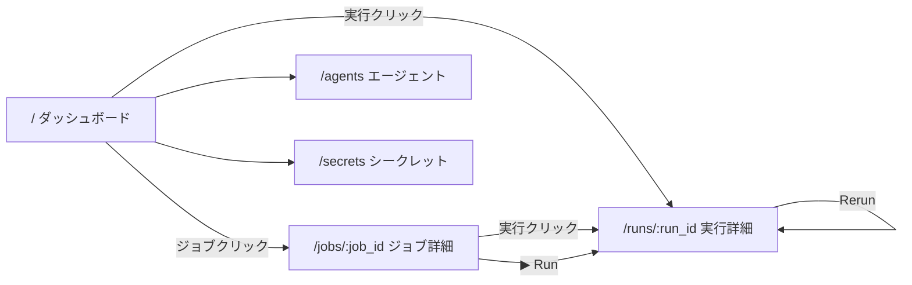

# Web UI 詳細設計

## 目的

postjen の操作と監視を行う Web UI を提供する。ブラウザからジョブの管理・実行・監視・ログ閲覧を行えるようにする。

## 技術構成

| 項目 | 選定 | 理由 |
|------|------|------|
| フレームワーク | Leptos | Rust フルスタック、WASM SPA |
| ビルド | trunk | Leptos 公式推奨の WASM ビルドツール |
| スタイリング | TailwindCSS | ユーティリティファースト、CDN で導入可能 |
| API 通信 | gloo-net (fetch) | WASM 環境での HTTP クライアント |
| リアルタイム | EventSource (SSE) | 既存の `/api/runs/:run_id/stream` を活用 |
| 配信方式 | postjen-server に埋め込み | ビルド済み WASM + HTML を `include_dir` でバイナリに埋め込み |

## クレート構成

```
crates/
  postjen-core/       # 共有ライブラリ（既存）
  postjen-server/     # API サーバ + UI 配信（既存、拡張）
  postjen-ui/         # Leptos フロントエンド（NEW）
```

### postjen-ui

- Leptos CSR（Client-Side Rendering）モード
- trunk でビルドし、`dist/` に出力
- `index.html` + WASM + JS をバンドル

### postjen-server への埋め込み

ビルド済みの UI 成果物を `postjen-server` にバイナリ埋め込みする。

- `include_dir` クレートで `dist/` を埋め込み
- axum の `GET /` 以下で静的ファイルとして配信
- API は `/api/*` パスで共存（既存のまま）

```
http://localhost:3000/           → UI (index.html)
http://localhost:3000/assets/*   → WASM, JS, CSS
http://localhost:3000/api/*      → REST API (既存)
```

## 画面構成

### 1. ダッシュボード (`/`)

トップページ。システム全体の状態を俯瞰する。

#### 画面要素

```
┌─────────────────────────────────────────────────┐
│  postjen                    [Agents] [Secrets]  │
├─────────────────────────────────────────────────┤
│  直近の実行                                      │
│  ┌─────┬──────────┬────────┬──────┬───────────┐ │
│  │ ID  │ ジョブ    │ ステータス│ トリガー│ 開始時刻    │ │
│  ├─────┼──────────┼────────┼──────┼───────────┤ │
│  │ #5  │ nightly  │ ● running│ cron │ 03:00:00  │ │
│  │ #4  │ my-ci    │ ✓ success│ webhook│ 02:45:12 │ │
│  │ #3  │ deploy   │ ✗ failed │ manual│ 02:30:00  │ │
│  │ ...                                          │ │
│  └──────────────────────────────────────────────┘ │
│                                                   │
│  ジョブ一覧                                       │
│  ┌──────────┬──────────┬────────┬──────────────┐ │
│  │ ジョブ ID │ 名前      │ 有効   │ [実行]        │ │
│  ├──────────┼──────────┼────────┼──────────────┤ │
│  │ my-ci    │ CI Build │ ✓      │ [▶ Run]      │ │
│  │ deploy   │ Deploy   │ ✓      │ [▶ Run]      │ │
│  └──────────────────────────────────────────────┘ │
└─────────────────────────────────────────────────┘
```

#### データ取得

- `GET /api/runs?limit=20` — 直近の実行一覧
- `GET /api/jobs` — ジョブ一覧
- 30 秒間隔でポーリング更新

#### 操作

- 実行行クリック → 実行詳細画面へ遷移
- ジョブ行クリック → ジョブ詳細画面へ遷移
- [▶ Run] ボタン → パラメータ入力ダイアログ → `POST /api/jobs/:job_id/runs`

### 2. ジョブ詳細 (`/jobs/:job_id`)

個別ジョブの定義内容と実行履歴。

#### 画面要素

```
┌─────────────────────────────────────────────────┐
│  ← 戻る    my-ci - CI Build          [▶ Run]   │
├─────────────────────────────────────────────────┤
│  定義情報                                        │
│  Path: /opt/jobs/my-ci.yaml                     │
│  Hash: abc123...                                │
│  Params: BRANCH (default: main), VERSION (required) │
│  Triggers: webhook ✓, cron: 0 0 3 * * *        │
│                                                   │
│  ノード構成 (DAG)                                 │
│  ┌──────┐   ┌──────┐                             │
│  │ test │──▶│ build│                              │
│  └──────┘   └──────┘                             │
│                                                   │
│  実行履歴                                         │
│  ┌─────┬────────┬──────┬──────────┬────────────┐ │
│  │ ID  │ ステータス│ トリガー│ 開始時刻    │ 所要時間    │ │
│  ├─────┼────────┼──────┼──────────┼────────────┤ │
│  │ #5  │ ✓ success│ cron │ 03:00:00 │ 2m 30s     │ │
│  │ #3  │ ✗ failed │ manual│ 02:30:00 │ 1m 15s    │ │
│  └──────────────────────────────────────────────┘ │
└─────────────────────────────────────────────────┘
```

#### データ取得

- `GET /api/jobs/:job_id` — ジョブ詳細
- `GET /api/runs?job_id=:job_id&limit=20` — 当該ジョブの実行履歴

#### DAG 可視化

- ノードを矩形、依存関係を矢印で表示
- 簡易的な CSS ベースのレイアウト（初期実装）
- ジョブ定義のノード・依存関係情報から動的に描画

### 3. 実行詳細 (`/runs/:run_id`)

個別 run の状態とノード実行状況。最も重要な監視画面。

#### 画面要素

```
┌─────────────────────────────────────────────────┐
│  ← 戻る    Run #5 - my-ci     [Cancel] [Rerun] │
├─────────────────────────────────────────────────┤
│  ステータス: ● running                            │
│  トリガー: webhook (github)                       │
│  パラメータ: BRANCH=develop                       │
│  開始: 2026-04-02 03:00:00  経過: 1m 23s         │
│                                                   │
│  ノード実行状況                                    │
│  ┌──────────────┬────────┬──────┬──────────────┐ │
│  │ ノード        │ ステータス│ Agent │ 所要時間     │ │
│  ├──────────────┼────────┼──────┼──────────────┤ │
│  │ test-unit    │ ✓ success│ local │ 45s         │ │
│  │ test-integ   │ ✓ success│ local │ 1m 10s      │ │
│  │ build        │ ● running│ linux │ 23s...      │ │
│  │ deploy       │ ○ pending│ -     │ -           │ │
│  └──────────────────────────────────────────────┘ │
│                                                   │
│  ログ                                             │
│  ┌──────────────────────────────────────────────┐ │
│  │ [test-unit ▼] [stdout ▼]                     │ │
│  │ $ make test-unit                              │ │
│  │ running 42 tests...                           │ │
│  │ all tests passed                              │ │
│  │ ...                                           │ │
│  └──────────────────────────────────────────────┘ │
└─────────────────────────────────────────────────┘
```

#### データ取得

- `GET /api/runs/:run_id` — 実行メタ情報
- `GET /api/runs/:run_id/events` — 状態遷移イベント
- `GET /api/runs/:run_id/logs?node_id=xxx&limit=200` — ログ
- `GET /api/runs/:run_id/stream` — SSE リアルタイム更新（run が終端状態でない場合）

#### SSE によるリアルタイム更新

- 実行詳細画面を開いた際、run が終端状態でなければ SSE 接続を開始する
- SSE イベント受信時にノード状態・ジョブ状態を画面に反映する
- ログは SSE イベント受信をトリガーに再取得する（差分取得: `after_sequence` パラメータ）
- run が終端状態に達したら SSE 接続を切断する

#### 操作

- [Cancel] ボタン → `POST /api/runs/:run_id/cancel`
- [Rerun] ボタン → `POST /api/runs/:run_id/rerun` → 新しい run の詳細画面へ遷移
- ノード行クリック → 当該ノードのログを表示
- ログのストリーム/ノード切り替えフィルタ

### 4. エージェント一覧 (`/agents`)

#### 画面要素

```
┌─────────────────────────────────────────────────┐
│  ← 戻る    エージェント                           │
├─────────────────────────────────────────────────┤
│  ┌──────────────┬──────────┬────────┬──────────┐ │
│  │ 名前          │ ホスト    │ ラベル  │ ステータス │ │
│  ├──────────────┼──────────┼────────┼──────────┤ │
│  │ local        │ localhost│ local  │ ● online │ │
│  │ linux-builder│ build-01 │ linux  │ ● online │ │
│  │ win-builder  │ build-02 │ windows│ ○ offline│ │
│  └──────────────────────────────────────────────┘ │
└─────────────────────────────────────────────────┘
```

#### データ取得

- `GET /api/agents` — エージェント一覧
- 15 秒間隔でポーリング更新

### 5. シークレット一覧 (`/secrets`)

#### 画面要素

```
┌─────────────────────────────────────────────────┐
│  ← 戻る    シークレット              [+ 追加]    │
├─────────────────────────────────────────────────┤
│  ┌──────────────┬──────────────┬──────────────┐ │
│  │ 名前          │ 登録日時      │ 操作          │ │
│  ├──────────────┼──────────────┼──────────────┤ │
│  │ DB_PASSWORD  │ 2026-04-02   │ [削除]        │ │
│  │ API_KEY      │ 2026-04-02   │ [削除]        │ │
│  └──────────────────────────────────────────────┘ │
└─────────────────────────────────────────────────┘
```

#### データ取得

- `GET /api/secrets` — シークレット一覧（値は非表示）

#### 操作

- [+ 追加] → 名前・値入力ダイアログ → `POST /api/secrets`
- [削除] → 確認ダイアログ → `DELETE /api/secrets/:name`

### 6. パラメータ入力ダイアログ

ジョブ実行時にパラメータが定義されている場合に表示するモーダル。

```
┌─────────────────────────────────┐
│  Run: my-ci                     │
│                                 │
│  BRANCH: [develop          ]    │
│  VERSION: [                ] *  │
│                                 │
│  * required                     │
│           [Cancel]  [▶ Run]     │
└─────────────────────────────────┘
```

- ジョブ定義の `params` からフォームを動的に生成
- `default` 値がある場合はプリセット
- `required` フィールドには必須マークを表示
- バリデーション: required が空なら送信不可

## 画面遷移



## コンポーネント設計

### Leptos コンポーネント構成

```
App
├── NavBar                    # ヘッダーナビゲーション
├── Router
│   ├── DashboardPage         # /
│   │   ├── RecentRunsTable   # 直近の実行一覧
│   │   └── JobListTable      # ジョブ一覧
│   ├── JobDetailPage         # /jobs/:job_id
│   │   ├── JobInfo           # ジョブ定義情報
│   │   ├── DagView           # ノード DAG 可視化
│   │   └── RunHistoryTable   # 実行履歴
│   ├── RunDetailPage         # /runs/:run_id
│   │   ├── RunInfo           # 実行メタ情報
│   │   ├── NodeRunsTable     # ノード実行状況
│   │   └── LogViewer         # ログ表示
│   ├── AgentsPage            # /agents
│   └── SecretsPage           # /secrets
├── RunJobDialog              # パラメータ入力モーダル
└── ConfirmDialog             # 確認ダイアログ
```

### 共通パターン

#### API 通信

```rust
// gloo-net による API 呼び出し
async fn fetch_json<T: DeserializeOwned>(url: &str) -> Result<T, String> {
    let resp = Request::get(url).send().await.map_err(|e| e.to_string())?;
    resp.json().await.map_err(|e| e.to_string())
}
```

#### SSE 接続

```rust
// 実行詳細画面の SSE リアルタイム更新
fn use_run_stream(run_id: i64) -> ReadSignal<Option<RunSnapshot>> {
    let (snapshot, set_snapshot) = create_signal(None);
    create_effect(move |_| {
        let source = EventSource::new(&format!("/api/runs/{run_id}/stream"));
        source.on_message(move |event| {
            if let Ok(data) = serde_json::from_str(&event.data()) {
                set_snapshot(Some(data));
            }
        });
    });
    snapshot
}
```

#### ポーリング更新

```rust
// ダッシュボードの定期更新
fn use_polling<T>(url: String, interval_ms: u64) -> ReadSignal<Option<T>> {
    let (data, set_data) = create_signal(None);
    set_interval(move || {
        spawn_local(async move {
            if let Ok(result) = fetch_json(&url).await {
                set_data(Some(result));
            }
        });
    }, Duration::from_millis(interval_ms));
    data
}
```

## ステータス表示

| ステータス | アイコン | 色 |
|-----------|---------|-----|
| `queued` | ○ | gray |
| `running` | ● (アニメーション) | blue |
| `success` | ✓ | green |
| `failed` | ✗ | red |
| `timed_out` | ⏱ | orange |
| `canceled` | ⊘ | gray |
| `skipped` | → | light gray |
| `pending` | ○ | light gray |

## API 追加要件

UI を構築するにあたり、以下の API 追加・拡張が必要。

### 必要な追加

| エンドポイント | 説明 |
|--------------|------|
| `GET /api/jobs/:job_id/definition` | YAML 定義の生データ（params, triggers, nodes 構造を返す） |
| `GET /api/runs/:run_id/nodes` | 当該 run のノード実行一覧（node_id, status, agent, 時間等） |

### 既存 API の拡張

| エンドポイント | 拡張内容 |
|--------------|---------|
| `GET /api/runs/:run_id` | `params_json` を応答に含める |

## ビルドと配信

### ビルドフロー

```bash
# 1. UI をビルド（trunk）
cd crates/postjen-ui
trunk build --release

# 2. サーバをビルド（UI 成果物を埋め込み）
cd ../..
cargo build -p postjen-server --release
```

### postjen-server での配信

```rust
// include_dir で dist/ を埋め込み
use include_dir::{include_dir, Dir};
static UI_DIR: Dir = include_dir!("$CARGO_MANIFEST_DIR/../postjen-ui/dist");

// axum の fallback でUI を配信
async fn serve_ui(uri: Uri) -> impl IntoResponse {
    let path = uri.path().trim_start_matches('/');
    match UI_DIR.get_file(path) {
        Some(file) => { /* Content-Type を判定して返却 */ }
        None => { /* index.html を返却（SPA ルーティング用） */ }
    }
}
```

- `/api/*` は既存の API ハンドラが処理
- それ以外のパスは `serve_ui` にフォールバック
- SPA ルーティングのため、存在しないパスは `index.html` を返す

## 段階的導入

### Phase 1: 最小限の監視画面

- ダッシュボード（実行一覧 + ジョブ一覧）
- 実行詳細（ノード状態 + ログ表示 + SSE リアルタイム更新）
- postjen-server への埋め込み配信

この段階で curl 操作の大部分を UI で代替できる。

### Phase 2: ジョブ管理と操作

- ジョブ詳細画面（DAG 可視化含む）
- パラメータ入力ダイアログによるジョブ実行
- キャンセル・再実行ボタン

### Phase 3: 管理画面

- エージェント一覧
- シークレット一覧（登録・削除）
- ジョブ定義の有効/無効切替
